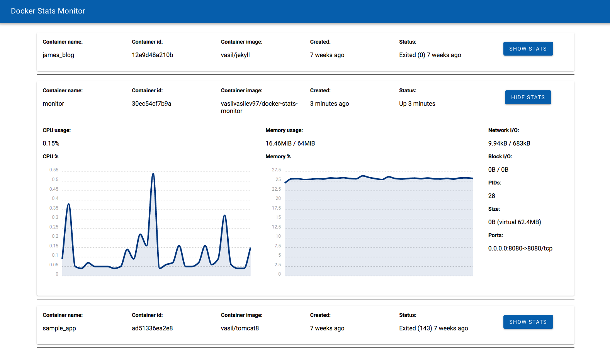

# Docker stats monitor



[Http4s](https://http4s.org) application that uses [fs2](https://fs2.io) streams to send `docker stats` and `docker ps` data over a websocket connection to a Scala JS frontend which visualizes the results using the [chartist.js](https://gionkunz.github.io/chartist-js/) library.

## Docker image
https://hub.docker.com/r/vasilvasilev97/docker-stats-monitor

Slim docker image (`FROM scratch`) containing only the application and docker binaries, along with the static site data. The application binary is completely statically compiled and linked Linux binary with absolutely no dependencies, generated using [GraalVM](https://www.graalvm.org) `native-image`.

Run with:

```
docker run -d --name monitor --memory=64m --memory-swap=64m -p 8080:8080 -v /var/run/docker.sock:/var/run/docker.sock vasilvasilev97/docker-stats-monitor
```

and visit [localhost:8080](http://localhost:8080/).

Note that we use `--memory` to configure the amount of memory available to the docker container. GraalVM native images can operate with a reasonably low memory consumption but it's impossible to figure out good ergonomics automatically on a machine with enough resources. Another option would be to configure heap size in the Dockerfile using [native image configuration options](https://github.com/oracle/graal/blob/master/substratevm/OPTIONS.md#garbage-collection-options).

To run with `docker-compose`:

```yaml
docker-stats:
  image: vasilvasilev97/docker-stats-monitor
  restart: always
  mem_limit: 64m
  volumes:
    - /var/run/docker.sock:/var/run/docker.sock:ro
  ports:
    - 8080:8080
```

## Tests

There are integration tests with Docker that can be run using `sbt run`. Note: the docker executable needs to be available on the `PATH` and the docker daemon needs to be running when executing the tests.
